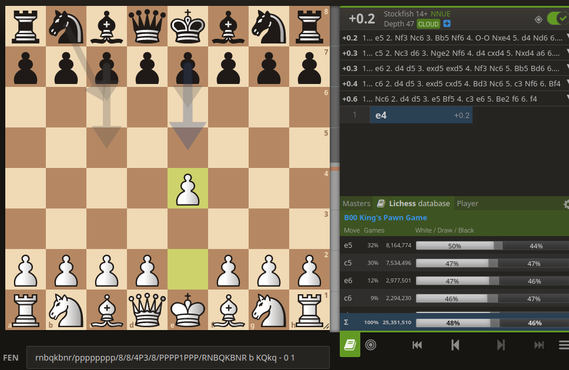

# auto_repertoire

Program which scrapes the Lichess opening database to find the statistically
optimal opening repertoire.

## Method

Lichess has a publically accessible opening explorer on their website
(https://lichess.org/analysis) and as an API endpoint. For each opening
position (= position in the first 25 moves of the game), it not only shows
how common each move is, but also the win/draw/loss percentage it achieves:

There are additional filters by time control (= how much time each player
has for the game, usually you only want to include slow games as they are
of higher quality), and filters by skill level (2000 is the largest of the
skillful groups, but if you are teaching someone at a lower level, it can
make sense to check out what moves they usually play).

While this is already very useful in identifying common mistakes and searching
for "good"/"bad" lines, it doesn't tell the whole truth. For example, 1. e4 e5
2. f4 f6 is very bad for Black on account of 3. fxe5 fxe5 4. Qh5+, but at 1200
level it only has a win percentage of 60% for White, due to most 1200s not
playing the moves 3. fxe5 and 4. Qh5+, after which the win percentage is 85%
for White. So in reality the expected value of the position 1. e4 e5 2. f4 f6
is 85%, given that White has these two moves in their repertoire.

This suggests the following algorithm:

Model your own color as always playing the "best" move. Model the opponent's
color as playing according to the move frequencies given by the explorer

1. Identify how common each position is from your point of view by multiplying
    the frequencies of the opponent moves down this path in the game tree
2. Every position that is above a certain threshold gets marked as a must-know
    position (it is a "max node" in the game tree)
3. Calculate EVs (expected values): Assume opponent picks randomly according to
    opening frequency, assume player picks best move by recursively maximizing
    their EV until an out-of-repertoire node is hit (just return its value)
4. Find which node are in the White/Black repertoire by following EV-maximizing
    moves

## Findings

- As White, it mostly likes 1. Nf3, since King's Indian structures score well
    - In the deepest setting for 2000s, it likes the legendary Queen's Gambit
- Against e4, it usually likes the Sicilian
    - In one setting for 2000s, it also liked the Modern Scandinavian
    (including the legendary Icelandic and Portuguese Gambit)
- Against d4, it usually likes Nf6 followed by c5
- At low levels it likes gambit

Funnily enough, I actually tried this out in order to switch away from the QG,
because I didn't like for instance the Grünfeld, but the script ended up finding
the QG as best opening anyway (I for sure thought it would be some aggressive
gambit line with 1. e4!) and found a good Grünfeld refutation.

## Scripts

- `auto_repertoire_dl.py`: Scrape the Lichess openings API and save to CSV
- `auto_repertoire.py`: Load CSV and produce set of must-learn positions
    and best_move recommendations.

## Shortcomings

- instead of looking at the most common positions, it should really look at
    which positions have their win rate raised the most by knowing a specific
    move (although as a chess player it is a good feeling to have prep for
    every line, even if the specific moves don't matter that much)
- some positions are so rare in the database that no reliable guess about
    its expected value can be made
- there might be some crucial moves beyond the frequency limit that everyone who
    plays the opening knows but that move would not end up in the repertoire
- it's not possible to download all moves at a high depth due to API limits

## TODOs

- make output filename in auto_repertoire_dl.py depend on params
- add argparse to auto_repertoire.py
- speed up get_children in auto_repertoire.py (pre-compute)
